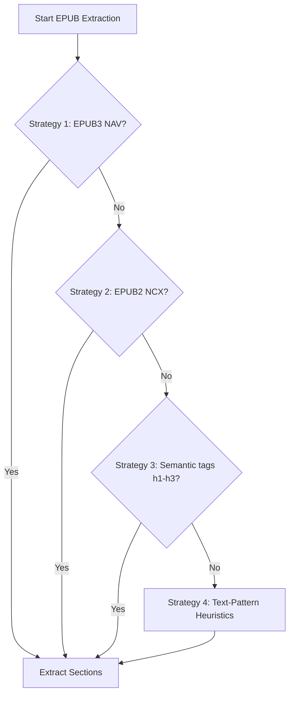

User: How should the development go? Let's say as time goes by, I keep processing and discovering different e-books and their structures. For now, epub itself might have different structures. Provided that it's fairly commen, I would want the system handle those special cases. Is modular/generic programming a good way to develop in the face of this uncertainty?

Gemini: Yes, **modular and strategy-based programming** is the absolute best way to manage this structural uncertainty. 

When dealing with user-generated files like EPUBs, PDFs, and Word documents, there is no single standard. Files are produced by Calibre, InDesign, Apple Pages, Microsoft Word, or random web scrapers, each introducing unique HTML dialects, styling classes, and hierarchy patterns.

Here is a recommended architectural blueprint for structuring the system to handle this variation sustainably over time:

---

### 1. File Type Strategy (The Package Level)
We have already built this foundation. By segregating file formats into separate strategy classes (`EPUBPreprocessor`, `PDFPreprocessor`, etc.) under a unified interface (`BasePreprocessor`), you prevent PDF parsing libraries and logic from leaking into or complicating the EPUB parsing pipeline.

---

### 2. Multi-Strategy Parsing (The Document Layout Level)
Within a single file format (like EPUB), you will encounter three main layout classes:
1. **Semantic & Compliant:** Properly defined EPUB 3 `<nav>` or EPUB 2 `<navMap>` tables of contents mapping to internal elements using anchor fragments.
2. **Flat but Structured:** No formal NCX/NAV anchors, but using standard semantic HTML elements (`<h1>`, `<h2>`, `<section>`) inside the documents.
3. **Flat & Unstructured:** Flat styled paragraphs (`<p class="calibre4">`) using text patterns (like the Dale Carnegie book).

Rather than writing one monolithic parser full of complex `if/else` statements, you should implement the **Chain of Responsibility** or **Strategy** pattern internally. You can define a pipeline of *TOC extraction strategies* that are executed in order of preference:



If we structure this in code, it looks like a list of strategies evaluated sequentially:

```python
class EPUBPreprocessor(BasePreprocessor):
    def extract_sections(self, file_path: Path) -> List[DocumentSection]:
        strategies = [
            ExplicitNavStrategy(),
            ExplicitNcxStrategy(),
            SemanticTagsStrategy(),
            TextPatternHeuristicStrategy(),
            FallbackSpineStrategy()  # Ultimate fallback: treat entire file bodies as sections
        ]
        
        for strategy in strategies:
            sections = strategy.extract(file_path)
            if len(sections) > 1: # Found a meaningful split!
                return sections
                
        return FallbackSpineStrategy().extract(file_path)
```

---

### 3. Separation of Schema (Analysis vs. Mutation)
Ensure your preprocessors output a **uniform data model** (the `DocumentSection` dataclass). 
* **The Frontend** only cares about the list of `DocumentSection` objects (IDs, titles, previews) to render in the UI.
* **The Backend Pipeline** only cares about receiving a list of segment IDs (e.g. `["ch1_sec_0", "ch1_sec_1"]`) and running a deterministic, matching segmenter in the workspace.
* Keeping the *presentation schema* unified means that no matter how complex your under-the-hood heuristics become to parse a new book layout, the frontend UI never has to change.

---

### 4. Golden Test Dataset (Regression Prevention)
As you encounter new e-book anomalies:
1. Extract a small sample (mock XHTML snippet) showing the weird formatting.
2. Add a new test case inside `tests/test_preprocessors.py`.
3. Refine or add a strategy in the preprocessing pipeline until the new test passes.
4. Run the entire test suite. This guarantees that your changes to support a newly discovered book format **never break the parsing logic** of books you already successfully supported.

By building small, self-contained layout strategy classes and securing them with unit tests, your e-book engine will remain clean, robust, and easily extensible.