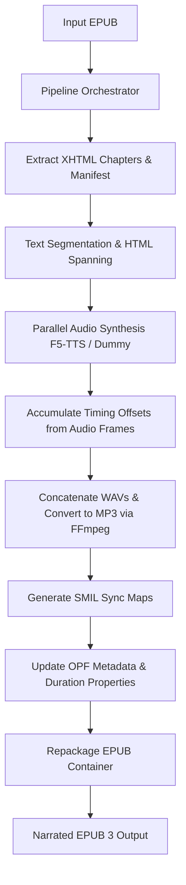

# epuboverlay

Generate standard, narrated **EPUB 3 files with Media Overlays** using F5-TTS voice cloning.

Instead of generating clunky, standalone `.lrc` files, `epuboverlay` modifies the EPUB container itself: it segments XHTML chapter text into individual sentences and clauses, wraps them in visual `<span id="...">` tags, synthesizes corresponding spoken audio in your own cloned voice, compresses it using `ffmpeg`, and generates standard W3C SMIL multimedia sync maps.

This allows modern e-book readers (such as Apple Books, Kobo, or Thorium Reader) to highlight paragraphs and sentences in real-time sync with the narrated audio, providing a premium, accessible audiobook-reading experience.

---

## Table of Contents
1. [System Architecture](#system-architecture)
2. [Key Features](#key-features)
3. [Prerequisites](#prerequisites)
4. [Installation](#installation)
5. [Usage](#usage)
   - [Web Dashboard (SPA)](#1-web-dashboard-spa)
   - [Command Line Interface (CLI)](#2-command-line-interface-cli)
6. [Configuration Reference](#configuration-reference)
7. [Under the Hood: Pipeline Phases](#under-the-hood-pipeline-phases)
8. [Caching & Resume State](#caching--resume-state)
9. [REST API Documentation](#rest-api-documentation)
10. [Testing & Verification](#testing--verification)
11. [License](#license)

---

## System Architecture

The following diagram illustrates how `epuboverlay` processes your e-book:



---

## Key Features

- 🚀 **AI Voice Cloning**: Leverages zero-shot voice cloning using the state-of-the-art F5-TTS model. Provide a short reference audio clip (WAV) and its text transcript to narrate the book in your own voice.
- ⚡ **Parallel Synthesis (Concurrency)**: Utilizes a concurrent thread pool to process text segments in parallel. This saturates modern GPUs (like RTX 40-series laptop GPUs) and speeds up narration generation by up to 2x–3x compared to sequential inference.
- 💾 **Persistent Chapter-Level Caching**: Hashes the input EPUB content (MD5) and your synthesizer settings (reference audio, text, frame rates, speeds). Processes are safe to interrupt; restarting the tool will skip already synthesized chapters and resume exactly where you left off.
- 🖥️ **Interactive Web Dashboard**: A premium dark-mode SPA featuring drag-and-drop uploads, live system hardware metrics (CPU, RAM, Disk, GPU/VRAM utilization & temperature), chapter-by-chapter progress visualizers, active job control (cancellation), streaming audio previews of finished chapters, and a direct download link for completed books.
- 📊 **CLI Progress Tracking**: Detailed CLI output with a progress bar, chapter/chunk indices, elapsed time, and live ETA calculations.
- 🔄 **CLI & Web Syncing**: The Web Dashboard detects and monitors background CLI execution jobs in real-time, allowing you to run jobs on headless servers and monitor them via the web interface.

---

## Prerequisites

### 1. System Requirements
- **Python**: 3.8 or higher.
- **FFmpeg**: Required to compress raw WAV audio output into MP3.
  ```bash
  # Debian/Ubuntu
  sudo apt update && sudo apt install ffmpeg
  
  # macOS (using Homebrew)
  brew install ffmpeg
  
  # Windows
  # Download binaries from ffmpeg.org and add them to your System PATH.
  ```

### 2. Synthesizer Dependencies
- **Dummy Mode**: Requires zero machine learning libraries and generates silent placeholders instantaneously. Great for debugging and validating EPUB packaging.
- **F5-TTS Mode**: Requires `f5-tts`, PyTorch, and a compatible backend (CUDA for Nvidia GPUs, MPS for Apple Silicon, or CPU fallback).

---

## Installation

1. **Clone the repository:**
   ```bash
   git clone <repo-url>
   cd epuboverlay
   ```

2. **Set up a virtual environment:**
   ```bash
   python3 -m venv .venv
   source .venv/bin/activate
   ```

3. **Install the package:**
   ```bash
   # Install in editable mode (includes web backend, CLI, and dummy mode)
   pip install -e .
   
   # Install F5-TTS Voice Cloning support (includes PyTorch & deep-learning deps)
   pip install f5-tts
   ```

---

## Usage

### 1. Web Dashboard (SPA)

The Web Dashboard is the easiest way to manage your book generation jobs, view live statistics, preview generated audio, and download the finished product.

Start the dashboard using the console script:
```bash
epuboverlay-web --port 8765 --host 127.0.0.1
```

Once started, navigate to `http://localhost:8765` in your browser.

- **Submit Jobs**: Drag and drop your EPUB file, upload your reference audio, paste the reference transcript, configure concurrency parameters, and press **Start Generation**.
- **Live System Metrics**: Watch real-time CPU, RAM, Disk, and GPU performance stats to tune concurrency safely.
- **Audio Previews**: As soon as a chapter is fully synthesized, it will list on the dashboard, allowing you to play the generated MP3 file in-browser before the entire book finishes.
- **Download**: Once the job changes to completed, download the resulting EPUB directly to your machine.

---

### 2. Command Line Interface (CLI)

You can run the generator directly via the console script or standard python module syntax.

```bash
# Option A: Using the console script
epuboverlay --epub my_book.epub -o my_book_narrated.epub --synthesizer dummy

# Option B: Using Python module execution
python -m epuboverlay --epub my_book.epub -o my_book_narrated.epub --synthesizer dummy
```

#### Running F5-TTS Voice Cloning (GPU Recommended)
```bash
python -m epuboverlay \
  --epub path/to/input.epub \
  -o path/to/output_synced.epub \
  --synthesizer f5-tts \
  --ref-audio path/to/voice_clip.wav \
  --ref-text "This is the text matching my short voice clip." \
  --device cuda \
  --concurrency 2
```

While running, the CLI outputs a detailed status bar:
```text
Orchestrating EPUB Media Overlay generation...
Input EPUB: my_book.epub
Output EPUB: my_book_narrated.epub
Synthesizer: f5-tts
Concurrency: 2

[Chapter 1/14] [Chunk 4/30] |████░░░░░░░░░░░░░░░░| 20.3% Elapsed: 1m14.2s ETA: ~4m51.8s (chapter_01)
```

---

## Configuration Reference

The following table lists all settings available in both the CLI options and the Web API:

| Option | Shortcut | Description | Default |
| :--- | :--- | :--- | :--- |
| `--epub` | | **[Required]** Absolute or relative path to the input EPUB 3 file. | |
| `--output-epub` | `-o` | **[Required]** Path where the output synced EPUB will be saved. | |
| `--synthesizer` | `-s` | Synthesis model to use: `f5-tts` or `dummy`. | `f5-tts` |
| `--ref-audio` | `-a` | Path to your reference voice sample (Required for `f5-tts`). | |
| `--ref-text` | `-t` | Verbatim text transcript of your reference audio clip (Required for `f5-tts`). | |
| `--device` | | Hardware device: `cuda`, `cpu`, or `mps`. | `None` (auto-detects) |
| `--speed` | | Rate of generated speech (e.g., `1.2` for 20% faster). | `1.0` |
| `--max-chars` | | Maximum character length of text sent to the synthesizer at once. | `150` |
| `--frame-rate` | | Audio sampling rate in Hz. | `24000.0` |
| `--concurrency` | `-c` | Number of concurrent threads processing chapter segments in parallel. | `2` |
| `--cache-dir` | | Custom folder path for intermediate chapter audio/SMIL caching. | `~/.epuboverlay/cache/...` |

---

## Under the Hood: Pipeline Phases

The `epuboverlay` generation process goes through several distinct phases:

### Phase 1: Parsing
The pipeline decompresses the input EPUB ZIP archive into a temporary folder structure. It reads `META-INF/container.xml` to locate the OPF package description file (`content.opf`). It parses the OPF manifest to map spine items in reading order, ignoring non-HTML contents (like cover pages, CSS files, and image assets).

### Phase 2: Segmentation & HTML Spanning
To map audio to text elements, the raw XHTML document is parsed using python's `xml.etree.ElementTree`.
1. **Block Element Extraction**: The parser identifies structural blocks (`<p>`, `<li>`, `<h1>` to `<h6>`, `<blockquote>`, etc.).
2. **Abbreviation Protection**: Sentence parsing ([split_into_sentences](file:///home/el02/epuboverlay/epuboverlay/pipeline.py#L235)) protects common abbreviation suffixes (e.g., `Mr.`, `Dr.`, `vs.`, initials like `A.`) to prevent premature splits.
3. **Clause Splitting**: If a sentence exceeds the `--max-chars` limit (150 chars), it is split on punctuation marks (`,`, `;`, `:`, `—`) using [chunk_text](file:///home/el02/epuboverlay/epuboverlay/pipeline.py#L262) to keep synthesis chunks natural and brief.
4. **Spanning**: The original text content inside each HTML block is replaced with `<span id="epuboverlay-s-N">` tags wrapped around each chunk.
5. **Entity Preservation**: Named HTML entities (such as `&nbsp;`, `&ldquo;`, `&rdquo;`) are temporarily mapped to XML-safe numeric character references (e.g. `&#160;`, `&#8220;`) before XML parsing to avoid XML serialization failures.

### Phase 3: Synthesizing (Voice Generation)
- Text chunks are fed into the selected synthesizer.
- The [F5TTSSynthesizer](file:///home/el02/epuboverlay/epuboverlay/pipeline.py#L68) calls `F5TTS.infer` using the reference audio sample and transcription, returning float32 audio arrays and the precise generated sample length.
- If `--concurrency` is greater than 1, synthesis of separate text spans within the chapter is executed in parallel using a `ThreadPoolExecutor`.

### Phase 4: Converting (Audio Processing & Timing)
1. **Timestamp Accumulation**: Because F5-TTS outputs exactly the audio generated for the provided text, the system calculates the duration of each chunk:
   $$\text{Duration (seconds)} = \frac{\text{Generated Audio Frames}}{\text{Frame Rate (Hz)}}$$
   The start and end times for each span ID are compiled sequentially by accumulating these durations.
2. **Audio Concatenation**: Individual WAV chunks are merged in memory using the Python standard `wave` library to form a continuous chapter-length audio stream.
3. **MP3 Compression**: The concatenated WAV is piped directly into `ffmpeg` and compressed to standard MP3 (`libmp3lame` codec, quality `-qscale:a 4`) to reduce package file sizes.

### Phase 5: Packaging (Metadata & Rebuild)
1. **SMIL Sync Maps**: For each chapter, a W3C SMIL document (`smil_c1.smil`) is generated mapping each visual span ID to its exact beginning/end time offset inside the chapter's MP3 file.
2. **OPF Updates**:
   - Manifest entries for SMIL overlays and MP3 tracks are added.
   - The `media-overlay` attribute is added to each chapter's `<itemref>` element to link it to the SMIL map.
   - Global book duration and individual chapter durations are registered inside the `<metadata>` tags using standard `<meta property="media:duration">` fields.
   - The `media:` namespace prefix is declared in the root `<package>` element.
3. **Archive Repackaging**: All files are re-zipped into a standard EPUB container. Crucially, the `mimetype` file is written uncompressed as the first entry in the ZIP directory to satisfy official EPUB validation specifications.

---

## Caching & Resume State

To make the tool robust against interruptions:
1. An MD5 hash of the original EPUB binary is calculated.
2. A configuration hash is calculated from the synthesizer class, speed, frame rate, max characters, reference audio metadata (size, path, modification time), and reference transcript text.
3. These hashes compose a unique cache directory: `~/.epuboverlay/cache/<epub_hash>_<config_hash>/`.
4. Inside this directory, the extracted EPUB workspace is preserved. Completed chapters have their audio written to `/audio/audio_{idref}.mp3` and sync maps to `smil_{idref}.smil`.
5. When running, the pipeline checks for both files and queries the duration of the SMIL mapping. If present, it skips synthesis for that chapter, adds its duration to the global sum, updates the OPF manifest references, and moves on immediately.

---

## REST API Documentation

The FastAPI backend exposes the following REST endpoints:

### Job Endpoints

#### 1. List Jobs
- **Route**: `GET /api/jobs`
- **Response**: Array of job objects. Includes active CLI processes detected on the host system.

#### 2. Create and Start Job
- **Route**: `POST /api/jobs`
- **Content-Type**: `multipart/form-data`
- **Parameters**:
  - `epub`: File (EPUB binary, required)
  - `synthesizer`: String (`f5-tts` or `dummy`, default `f5-tts`)
  - `ref_audio`: File (WAV/MP3 reference sample, required for `f5-tts`)
  - `ref_text`: String (reference text transcript, required for `f5-tts`)
  - `device`: String (`cuda`, `cpu`, `mps`, or empty)
  - `speed`: Float (default `1.0`)
  - `max_chars`: Integer (default `150`)
  - `frame_rate`: Float (default `24000.0`)
  - `concurrency`: Integer (default `2`)
- **Response**: Details of the created job.
- **Errors**: Returns `409 Conflict` if another job is already running.

#### 3. Get Job Details
- **Route**: `GET /api/jobs/{job_id}`
- **Response**: Status and progress dictionary for the requested job.

#### 4. Cancel Job
- **Route**: `POST /api/jobs/{job_id}/cancel`
- **Behavior**: Signals a running thread to cancel. If a CLI job, sends a `SIGTERM` kill signal to the process ID.

#### 5. Download Completed EPUB
- **Route**: `GET /api/jobs/{job_id}/download`
- **Response**: Synced EPUB binary attachment.
- **Errors**: `400 Bad Request` if job is not completed.

#### 6. Stream Chapter Audio
- **Route**: `GET /api/jobs/{job_id}/audio/{chapter_idref}`
- **Response**: MP3 audio stream for inline browser player.

#### 7. SSE Progress Stream
- **Route**: `GET /api/jobs/{job_id}/events`
- **Response**: Server-Sent Events stream delivering real-time status payloads:
  ```json
  {
    "id": "job_id",
    "status": "running",
    "progress": {
      "phase": "synthesizing",
      "chapter_index": 2,
      "chapter_total": 12,
      "chapter_name": "chapter_02",
      "chunk_index": 14,
      "chunk_total": 45,
      "elapsed_seconds": 45.2,
      "message": "Synthesizing chunk...",
      "overall_percent": 21.5
    }
  }
  ```

### System Resources

#### Get System Resource Stats
- **Route**: `GET /api/stats`
- **Response**: Live utilization metrics for CPU, RAM, Disk space, and GPU specifications (VRAM usage, percentage, temperature parsed via `nvidia-smi`).

---

## Testing & Verification

Comprehensive test suites are included to verify individual components. Tests cover sentence boundary detection, abbreviation protection parsing, timing offset accumulation, HTML entity processing, cache persistence, and full end-to-end simulated EPUB generation.

To run the automated unit tests, run the following command in the project root:
```bash
python -m unittest discover -v
```

All test cases are defined under the [tests/test_pipeline.py](file:///home/el02/epuboverlay/tests/test_pipeline.py) module.

---

## License

This project is licensed under the Apache License, Version 2.0. See the [LICENSE](file:///home/el02/epuboverlay/LICENSE) file for the full license text.
