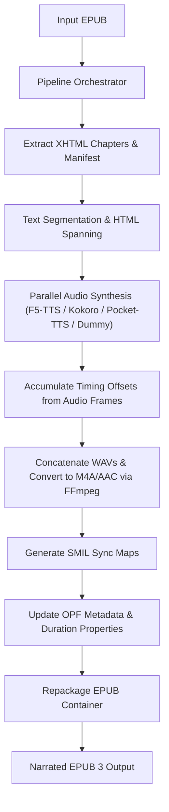

# epuboverlay

Generate standard, narrated **EPUB 3 files with Media Overlays** using F5-TTS, Kokoro, or Pocket-TTS, and extract M4A/MP3 + LRC file pairs from narrated e-books.

Instead of generating clunky, standalone `.lrc` files, `epuboverlay` modifies the EPUB container itself: it segments XHTML chapter text into individual sentences and clauses, wraps them in visual `<span id="...">` tags, synthesizes corresponding spoken audio in your chosen voice, compresses it to standard M4A/AAC (or MP3) using `ffmpeg`, and generates standard W3C SMIL multimedia sync maps. It also supports extraction and optional merging of existing media overlays into standard audio tracks and lyrics files.

This allows modern e-book readers (such as Apple Books, Kobo, or Thorium Reader) to highlight paragraphs and sentences in real-time sync with the narrated audio, providing a premium, accessible audiobook-reading experience.

---

## Table of Contents
1. [System Architecture](#system-architecture)
2. [Key Features](#key-features)
3. [Prerequisites](#prerequisites)
4. [Installation](#installation)
5. [Usage](#usage)
   - [Web Dashboard (SPA)](#1-web-dashboard-spa)
   - [Command Line Interface (CLI)](#2-command-line-interface-cli)
6. [Configuration Reference](#configuration-reference)
7. [Under the Hood: Pipeline Phases](#under-the-hood-pipeline-phases)
8. [Caching & Resume State](#caching--resume-state)
9. [REST API Documentation](#rest-api-documentation)
10. [Testing & Verification](#testing--verification)
11. [License](#license)

---

## System Architecture

The following diagram illustrates how `epuboverlay` processes your e-book:



---

## Key Features

- 🚀 **Multi-Engine Speech Synthesis**: Supports generation via F5-TTS, Hexgrad Kokoro-82M, Pocket-TTS, or a lightweight Dummy synthesizer.
- 🎭 **AI Voice Cloning & Blending**: 
  - Zero-shot voice cloning using F5-TTS or Pocket-TTS (Kyutai Labs). Provide a short reference audio clip (.wav) to clone your own voice.
  - Voice formula blending using Kokoro (e.g. `af_heart*0.6+af_sky*0.4`) with slider controls, presets, and real-time voice previews.
- 📝 **Advanced Text Normalization**: Built-in pipeline with customizable settings for numeral expansion, contraction resolution, heteronym resolution, punctuation harmonization, and custom lexicons.
- ⚡ **Parallel Synthesis & Multiprocessing**: Utilizes a multiprocessing backend to process text segments in parallel, saturating modern GPUs and speeding up narration generation by up to 2x–3x compared to sequential inference.
- 💾 **Persistent & Scoped Cache**: Hashes input EPUB content and synthesizer configurations, caching assets in structured subdirectories. Features automated legacy cache migration to gracefully move older flat structure caches.
- 🔄 **Job Resumption with Config Editing**: Failed or cancelled generation jobs can be resumed from the Web UI or via the REST API, with the option to update execution parameters (like device, speed, concurrency, NFE, or model compilation) without starting over.
- 📤 **EPUB Media Overlay Extraction**: Extract high-quality M4A/MP3 tracks and matching `.lrc` sync lyric files from EPUB3 files with media overlays, with optional chapter merging into a single audio/LRC file pair for playback on portable players (e.g. Poweramp).
- 🖥️ **Interactive Web Dashboard**: A premium dark-mode SPA featuring drag-and-drop uploads for both generation and extraction, live system hardware metrics (CPU, RAM, Disk, GPU/VRAM), chapter-by-chapter progress visualizers, active job control (cancellation, resumption), streaming audio previews, and direct download links.
- 📊 **CLI Progress Tracking**: Detailed CLI output with subcommands, progress bar, chapter/chunk indices, elapsed time, characters processed, and live ETA calculations.
- 🔄 **CLI & Web Syncing**: The Web Dashboard detects and monitors background CLI execution jobs in real-time, allowing you to run jobs on headless servers and monitor them via the web interface.

---

## Prerequisites

### 1. System Requirements
- **Python**: 3.8 or higher.
- **FFmpeg**: Required to compress raw WAV audio output into M4A/AAC or MP3.
  ```bash
  # Debian/Ubuntu
  sudo apt update && sudo apt install ffmpeg

  # macOS (using Homebrew)
  brew install ffmpeg

  # Windows
  # Download binaries from ffmpeg.org and add them to your System PATH.
  ```

### 2. Synthesizer Dependencies
- **Dummy Mode**: Requires zero machine learning libraries and generates silent placeholders instantaneously. Great for debugging and validating EPUB packaging.
- **F5-TTS Mode**: Requires `f5-tts`, PyTorch, and a compatible backend (CUDA for Nvidia GPUs, MPS for Apple Silicon, or CPU fallback).
- **Kokoro Mode**: Requires `kokoro>=0.9.4` (Hexgrad Kokoro-82M), PyTorch, and a compatible backend (CPU/GPU).
- **Pocket-TTS Mode**: Requires `pocket-tts`, `scipy`, and `numpy` for CPU-efficient local zero-shot voice cloning.

---

## Installation

1. **Clone the repository:**
   ```bash
   git clone <repo-url>
   cd epuboverlay
   ```

2. **Set up a virtual environment:**
   ```bash
   python3 -m venv .venv
   source .venv/bin/activate
   ```

3. **Install the package and dependencies:**
   ```bash
   # Install the package and all its synthesizer backend dependencies (f5-tts, kokoro, pocket-tts)
   pip install -e .
   ```

---

## Usage

### 1. Web Dashboard (SPA)

The Web Dashboard is the easiest way to manage your book generation jobs, view live statistics, preview generated audio, extract M4A/MP3s + LRCs, and download the finished product.

Start the dashboard using the console script:
```bash
epuboverlay-web --port 8765 --host 127.0.0.1
```

Once started, navigate to `http://localhost:8765` in your browser.

- **Generate Overlays**: Drag and drop your EPUB file, select your synthesizer backend, configure parameters (such as voice blends, speed, concurrency, and model compilation), and press **Start Generation**.
- **Extract Audio & Lyrics**: Use the **Extract MP3 + LRC** tab to upload an existing narrated EPUB, choose whether to merge chapters, and extract a ZIP package containing the audio files and corresponding `.lrc` sync maps.
- **Job Resumption**: Interrupted, cancelled, or failed jobs can be resumed. Clicking **Resume** opens a configuration dialog where you can tweak inference settings before continuing the job.
- **Live System Metrics**: Watch real-time CPU, RAM, Disk, and GPU performance stats to monitor execution.
- **Audio Previews**: As soon as a chapter is fully synthesized, it will list on the dashboard for instant playing.
- **Download**: Download completed synced EPUBs directly from the dashboard.

---

### 2. Command Line Interface (CLI)

The CLI uses subcommands to handle generation and extraction.

```bash
# General help
epuboverlay --help

# Subcommand-specific help
epuboverlay generate --help
epuboverlay extract --help
```

#### A. Generating Synced EPUBs (`generate` subcommand)

Run the generator via the console script or python module syntax:
```bash
# Option A: Using the console script
epuboverlay generate --epub my_book.epub -o my_book_narrated.epub --synthesizer dummy

# Option B: Using Python module execution
python -m epuboverlay generate --epub my_book.epub -o my_book_narrated.epub --synthesizer dummy
```

##### Running F5-TTS Voice Cloning (GPU Recommended)
```bash
python -m epuboverlay generate \
  --epub path/to/input.epub \
  -o path/to/output_synced.epub \
  --synthesizer f5-tts \
  --ref-audio path/to/voice_clip.wav \
  --ref-text "This is the text matching my short voice clip." \
  --device cuda \
  --concurrency 2
```

##### Running Kokoro Synthesizer (Fast & CPU/GPU Friendly)
```bash
python -m epuboverlay generate \
  --epub path/to/input.epub \
  -o path/to/output_synced.epub \
  --synthesizer kokoro \
  --voice af_heart \
  --concurrency 2
```

##### Running Pocket-TTS Synthesizer (Lightweight CPU Voice Cloning)
```bash
python -m epuboverlay generate \
  --epub path/to/input.epub \
  -o path/to/output_synced.epub \
  --synthesizer pocket-tts \
  --ref-audio path/to/voice_clip.wav \
  --concurrency 2
```

While running, the CLI outputs a detailed status bar:
```text
Orchestrating EPUB Media Overlay generation...
Input EPUB: my_book.epub
Output EPUB: my_book_narrated.epub
Synthesizer: f5-tts
Concurrency: 2

[Chapter 1/14] [Chunk 4/30] |████░░░░░░░░░░░░░░░░| 20.3% Elapsed: 1m14.2s ETA: ~4m51.8s (chapter_01)
```

#### B. Extracting MP3 + LRC (`extract` subcommand)

Extract audio tracks and `.lrc` lyric files from an EPUB that already has Media Overlays:
```bash
# Extract separate audio + LRC pairs for each chapter (auto-detects M4A/MP3)
epuboverlay extract --epub my_book_narrated.epub -o output_dir/

# Extract and merge all chapters into a single audio + LRC pair
epuboverlay extract --epub my_book_narrated.epub -o output_dir/ --merge
```

---

## Configuration Reference

The following table lists the settings available in the generation CLI/Web API:

| Option | Shortcut | Description | Default | Availability |
| :--- | :--- | :--- | :--- | :--- |
| `--epub` | | **[Required]** Absolute or relative path to the input EPUB 3 file. | | CLI & Web |
| `--output-epub` | `-o` | **[Required]** Path where the output synced EPUB will be saved. | | CLI & Web |
| `--synthesizer` | `-s` | Synthesis model to use: `f5-tts`, `kokoro`, `pocket-tts`, or `dummy`. | `f5-tts` | CLI & Web |
| `--ref-audio` | `-a` | Path to your reference voice sample (Required for `f5-tts` and `pocket-tts`). | | CLI & Web |
| `--ref-text` | `-t` | Verbatim text transcript of your reference audio clip (Required for `f5-tts`). | | CLI & Web |
| `--voice` | | Name of the built-in Kokoro voice to use (e.g. `af_heart`). | `""` | CLI & Web |
| `--voice-formula` | | Custom voice mix formula for Kokoro (e.g. `af_heart*0.6+af_sky*0.4`). | `""` | CLI & Web |
| `--lang-code` | | Kokoro language code (e.g. `a` for American English, `b` for British English). | `a` | CLI & Web |
| `--compile` | | Optimize inference speed by compiling the model via `torch.compile` (f5-tts only). | `False` | CLI & Web |
| `--device` | | Hardware device: `cuda`, `cpu`, or `mps`. | `None` (auto-detects) | CLI & Web |
| `--speed` | | Rate of generated speech (e.g., `1.2` for 20% faster). | `1.0` | CLI & Web |
| `--max-chars` | | Maximum character length of text sent to the synthesizer at once. | `150` | CLI & Web |
| `--frame-rate` | | Audio sampling rate in Hz. | `24000.0` | CLI & Web |
| `--concurrency` | `-c` | Number of concurrent processes/workers for synthesis. | `2` | CLI & Web |
| `--cache-dir` | | Custom folder path for intermediate chapter audio/SMIL caching. | `~/.epuboverlay/cache/...` | CLI Only |
| `nfe_step` | | Number of inference steps for F5-TTS model (min: 10, max: 64). | `32` | Web API Only |
| `compile` | | Optimize inference speed by compiling the model via `torch.compile` (the first chunk takes 1-2 minutes). | `False` | Web API Only |

---

## Under the Hood: Pipeline Phases

### Phase 1: Parsing
The pipeline decompresses the input EPUB ZIP archive into a temporary folder structure. It reads `META-INF/container.xml` to locate the OPF package description file (`content.opf`). It parses the OPF manifest to map spine items in reading order, ignoring non-HTML contents (like cover pages, CSS files, and image assets).

### Phase 2: Segmentation & HTML Spanning
To map audio to text elements, the raw XHTML document is parsed using python's `xml.etree.ElementTree`.
1. **Block Element Extraction**: The parser identifies structural blocks (`<p>`, `<li>`, `<h1>` to `<h6>`, `<blockquote>`, etc.).
2. **Abbreviation Protection**: Sentence parsing ([split_into_sentences](file:///home/rasulovelyor/Projects/epuboverlay/epuboverlay/pipeline.py#L235)) protects common abbreviation suffixes (e.g., `Mr.`, `Dr.`, `vs.`, initials like `A.`) to prevent premature splits.
3. **Clause Splitting**: If a sentence exceeds the `--max-chars` limit (150 chars), it is split on punctuation marks (`,`, `;`, `:`, `—`) using [chunk_text](file:///home/rasulovelyor/Projects/epuboverlay/epuboverlay/pipeline.py#L262) to keep synthesis chunks natural and brief.
4. **Spanning**: The original text content inside each HTML block is replaced with `<span id="epuboverlay-s-N">` tags wrapped around each chunk.
5. **Entity Preservation**: Named HTML entities (such as `&nbsp;`, `&ldquo;`, `&rdquo;`) are temporarily mapped to XML-safe numeric character references (e.g. `&#160;`, `&#8220;`) before XML parsing to avoid XML serialization failures.

### Phase 3: Synthesizing (Voice Generation)
- Text chunks are fed into the selected synthesizer.
- The [F5TTSSynthesizer](file:///home/rasulovelyor/Projects/epuboverlay/epuboverlay/synthesizers/f5tts.py) calls `F5TTS.infer` using the reference audio sample and transcription, returning float32 audio arrays and the precise generated sample length.
- The [KokoroSynthesizer](file:///home/rasulovelyor/Projects/epuboverlay/epuboverlay/synthesizers/kokoro.py) handles generation using the lightweight Hexgrad Kokoro-82M engine.
- The [PocketSynthesizer](file:///home/rasulovelyor/Projects/epuboverlay/epuboverlay/synthesizers/pocket.py) uses Kyutai Labs' lightweight CPU zero-shot voice cloning model.
- If `--concurrency` is greater than 1, synthesis of separate text spans within the chapter is executed in parallel using a `ThreadPoolExecutor` (or via separate processes depending on execution constraints).

### Phase 4: Converting (Audio Processing & Timing)
1. **Timestamp Accumulation**: Because synthesizers output exactly the audio generated for the provided text, the system calculates the duration of each chunk:
   $$\text{Duration (seconds)} = \frac{\text{Generated Audio Frames}}{\text{Frame Rate (Hz)}}$$
   The start and end times for each span ID are compiled sequentially by accumulating these durations.
2. **Audio Concatenation**: Individual WAV chunks are merged in memory or compiled via temporary files to form a continuous chapter-length audio stream.
3. **M4A/AAC Compression**: The concatenated WAV is processed and compressed to standard M4A (AAC-LC) using `ffmpeg` to reduce package file sizes while complying with EPUB 3 audio recommendations (with MP3 fallbacks supported).

### Phase 5: Packaging (Metadata & Rebuild)
1. **SMIL Sync Maps**: For each chapter, a W3C SMIL document (`smil_c1.smil`) is generated mapping each visual span ID to its exact beginning/end time offset inside the chapter's M4A/MP3 file.
2. **OPF Updates**:
   - Manifest entries for SMIL overlays and M4A/MP3 tracks are added.
   - The `media-overlay` attribute is added to each chapter's `<itemref>` element to link it to the SMIL map.
   - Global book duration and individual chapter durations are registered inside the `<metadata>` tags using standard `<meta property="media:duration">` fields.
   - The `media:` namespace prefix is declared in the root `<package>` element.
3. **Archive Repackaging**: All files are re-zipped into a standard EPUB container. Crucially, the `mimetype` file is written uncompressed as the first entry in the ZIP directory to satisfy EPUB validation specifications.

---

## Caching & Resume State

To make the tool robust against interruptions:
1. An MD5 hash of the original EPUB binary is calculated.
2. A configuration hash is calculated from the synthesizer class, speed, frame rate, max characters, reference audio metadata (size, path, modification time), and reference transcript text.
3. These hashes compose a unique cache directory: `~/.epuboverlay/cache/<epub_hash>_<config_hash>/`.
4. Inside this directory, the extracted EPUB workspace is preserved. Completed chapters have their audio written to `{chapter_rel_dir}/audio/audio_{idref}.m4a` and sync maps to `{chapter_rel_dir}/smil_{idref}.smil` (matching their relative chapter location within the EPUB container).
5. On startup, the pipeline automatically detects and migrates legacy cache files (previously stored under the main OPF directory) to the new subdirectory-scoped structure.
6. When running, the pipeline checks for both files and queries the duration of the SMIL mapping. If present, it skips synthesis for that chapter, adds its duration to the global sum, updates the OPF manifest references, and moves on immediately.

---

## REST API Documentation

The FastAPI backend exposes the following REST endpoints:

### Job Endpoints

#### 1. List Jobs
- **Route**: `GET /api/jobs`
- **Response**: Array of job objects. Includes active CLI processes detected on the host system.

#### 2. Create and Start Job
- **Route**: `POST /api/jobs`
- **Content-Type**: `multipart/form-data`
- **Parameters**:
  - `epub`: File (EPUB binary, required)
  - `synthesizer`: String (`f5-tts`, `kokoro`, `pocket-tts`, or `dummy`, default `f5-tts`)
  - `ref_audio`: File (WAV/MP3/M4A reference sample, required for `f5-tts` and `pocket-tts`)
  - `ref_text`: String (reference text transcript, required for `f5-tts`)
  - `voice`: String (name of Kokoro voice, e.g. `af_heart`)
  - `voice_formula`: String (Kokoro voice mix formula, e.g. `af_heart*0.6+af_sky*0.4`)
  - `lang_code`: String (Kokoro language code, default `a`)
  - `device`: String (`cuda`, `cpu`, `mps`, or empty)
  - `speed`: Float (default `1.0`)
  - `max_chars`: Integer (default `150`)
  - `frame_rate`: Float (default `24000.0`)
  - `concurrency`: Integer (default `2`)
  - `nfe_step`: Integer (default `32`)
  - `compile`: Boolean (default `false`)
- **Response**: Details of the created job. Includes estimated audiobook duration and total character counts.
- **Errors**: Returns `409 Conflict` if another job is already running.

#### 3. Get Job Details
- **Route**: `GET /api/jobs/{job_id}`
- **Response**: Status, details, and progress dictionary for the requested job.

#### 4. Cancel Job
- **Route**: `POST /api/jobs/{job_id}/cancel`
- **Behavior**: Signals a running process to cancel. If a CLI job, sends a `SIGTERM` kill signal to the process ID.

#### 5. Download Completed EPUB
- **Route**: `GET /api/jobs/{job_id}/download`
- **Response**: Synced EPUB binary attachment.
- **Errors**: `400 Bad Request` if job is not completed.

#### 6. Stream Chapter Audio
- **Route**: `GET /api/jobs/{job_id}/audio/{chapter_idref}`
- **Response**: Audio stream (supports M4A/MP3) for inline browser player.

#### 7. SSE Progress Stream
- **Route**: `GET /api/jobs/{job_id}/events`
- **Response**: Server-Sent Events stream delivering real-time status payloads:
  ```json
  {
    "id": "job_id",
    "status": "running",
    "progress": {
      "phase": "synthesizing",
      "chapter_index": 2,
      "chapter_total": 12,
      "chapter_name": "chapter_02",
      "chunk_index": 14,
      "chunk_total": 45,
      "elapsed_seconds": 45.2,
      "message": "Synthesizing chunk...",
      "overall_percent": 21.5,
      "synthesis_elapsed_seconds": 12.4,
      "total_chunks_to_synthesize": 120,
      "chunks_processed_so_far": 24,
      "total_characters": 85000,
      "estimated_total_hours": 1.57,
      "audiobook_duration_seconds": 0.0,
      "estimated_remaining_seconds": 182.4
    }
  }
  ```

#### 8. Resume Job
- **Route**: `POST /api/jobs/{job_id}/resume`
- **Content-Type**: `application/x-www-form-urlencoded` or `multipart/form-data`
- **Parameters** (all optional):
  - `synthesizer`: String (`f5-tts`, `kokoro`, `pocket-tts`, or `dummy`)
  - `device`: String (`cuda`, `cpu`, `mps`, or empty)
  - `speed`: Float
  - `max_chars`: Integer
  - `frame_rate`: Float
  - `concurrency`: Integer
  - `nfe_step`: Integer
  - `compile`: Boolean
  - `voice`: String
  - `voice_formula`: String
  - `lang_code`: String
- **Response**: Details of the updated and restarted job.
- **Errors**: Returns `400 Bad Request` if the job is not in a failed/cancelled state, or `409 Conflict` if another job is already running.

#### 9. Extract Audio + LRC
- **Route**: `POST /api/extract`
- **Content-Type**: `multipart/form-data`
- **Parameters**:
  - `epub`: File (EPUB binary, required)
  - `merge`: Boolean (default `false`)
- **Response**: A ZIP archive containing extracted per-chapter or merged M4A/MP3+LRC files.

### System Resources

#### Get System Resource Stats
- **Route**: `GET /api/stats`
- **Response**: Live utilization metrics for CPU, RAM, Disk space, and GPU specifications (VRAM usage, percentage, temperature parsed via `nvidia-smi`).

---

## Testing & Verification

Comprehensive test suites are included to verify individual components. Tests cover sentence boundary detection, abbreviation protection parsing, timing offset accumulation, HTML entity processing, cache persistence, full end-to-end simulated EPUB generation, and media overlay extraction.

To run the automated unit tests, run the following command in the project root:
```bash
python -m unittest discover -v
```

All test cases are defined under the [tests/test_pipeline.py](file:///home/rasulovelyor/Projects/epuboverlay/tests/test_pipeline.py) and [tests/test_extract.py](file:///home/rasulovelyor/Projects/epuboverlay/tests/test_extract.py) modules.

---

## License

This project is licensed under the Apache License, Version 2.0. See the [LICENSE](file:///home/rasulovelyor/Projects/epuboverlay/LICENSE) file for the full license text.
